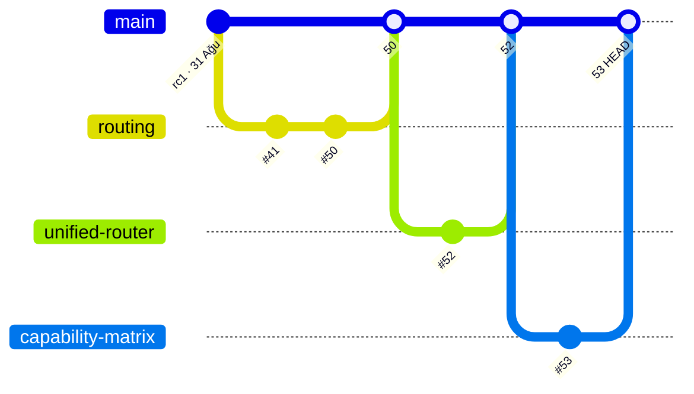

# Pineal-clean — Genel Durum Haritası ve Eksik Analizi

**Tarih:** 2026-09-02 · **Kontrol edilen repo:** `AppleCurse/pineal-clean` · **Ana dal HEAD:** `b14a8e16` ✅ CI 11/11 yeşil

---

## 0. Tek cümlelik özet

> Tüm çalışma **main**'de toplanmış durumda (açık PR: **0**, CI: **yeşil**), ancak **iki gerçek açık var**:
> **(1)** `v3.0.0-rc.2` mühür commit'i ana dala hiç girmemiş (orphan dalda, PR'siz), **(2)** Hindsight Memory batch-insert performans işi (#49) kapatılmış ama **main'e hiç girmedi**. Ayrıca 14 adet "birleşmiş ama silinmemiş" bayat uzak dal temizlik bekliyor.

---

## 1. Ne oldu? — Son 2 günün hikâyesi (main yolculuğu)

| Saat (2 Eyl) | PR | Commit | Ne yapıldı |
|---|---|---|---|
| 00:49 | #50 | `2d512be` | WebSocket/token işlemleri + router boşluk kapatmaları |
| 03:39 | #52 | `4f286cb` | **UnifiedRouter `/v1` yoluna bağlandı**, capability tabanlı agent rotalaması, katalog otomatik yapılandırma |
| 04:20 | #53 | `b14a8e16` | **2026-09-02 karar matrisi**: Sonnet-5/Grok 4.6/Gemini 3.7 Flash chain'leri, verifier extract/judgment ayrımı, katalog + fiyat güncellemesi (6 dosya, **+156 / −34**) |

Kısa özümleme: Proje **22 Ağu → 2 Eyl** arasında 52 PR'lık bir yol kat etti ve bugün **`v3.0.0-rc.1`** sürüm etiketi üzerinde **"router yayılma dalgası"** ile sonlandı. Capability policy patch'i kaybolmadı — **#52 + #53 olarak main'de**.

## 2. Harita (kroki) — dallar ve kaderleri

```
                                github.com/AppleCurse/pineal-clean
┌──────────────────────────────────────────────────────────────────────────────┐
│                                                                            │
│   ❰ MAIN ❱  b14a8e16  —  CI ✅ (backend · frontend · rust · android · smoke)│
│   │                                                                        │
│   ├──↳ #53  arena/01a05fea   squash etkisi                                │
│   ├──↳ #52  arena/01a05f9e   squash etkisi                                │
│   ├──↳ #50  arena/01a05f2a   squash etkisi  (+#51 duplikat kapandı)        │
│   ├──↳ #48  arena/01a05d21 / #47 01a05c9b / #46..42 / #41 / #39 / #38 / #37│
│   ├──↳ #36  arena/01a0505e / #33 01a04b6f / #32 01a04b6e / #31 fix-static  │
│   └──↳ (22–31 Ağu)  kanıt-vasatı, OSINT FAZ 1-5, hardening, rc.1            │
│                                                                            │
│   ❰ DALLAR ❱ (GitHub'da hâlâ duruyor)                                      │
│   ├── ✅ 14 DAL  → merge edildi ama silinmedi  → 🧹 silinebilir              │
│   ├── ⚠️ arena/01a05c99  → PR YOK → rc.2 SEAL commit'i (b4a12542)           │
│   │      "VERSION 3.0.0-rc.2 + RELEASE_EVIDENCE.md + rc.2.json"            │
│   │      ⚠️ main'de BU DOSYALAR YOK → kayıp iş                             │
│   ├── ⚠️ bolt-optimize-hindsight…  → #49 CLOSED (merge edilmedi)            │
│   │      executemany batch insert → main'de YOK → kayıp perf işi           │
│   └── 🔵 jules/osint-industries…   → #13 CLOSED → içerik #33 ile KAPSANDI   │
│                                                                            │
└──────────────────────────────────────────────────────────────────────────────┘

   LOKAL (bu oturum): arena/01a06052 ── 0 ahead / 1 behind main (b14a8e16 eksik)
```



## 3. Dallar envanteri (GitHub'daki 18 dal)

| Uzak dal | PR | Durum | Son commit (yerel saat) | main'e göre |
|---|---|---|---|---|
| `main` | — | ✅ HEAD | `b14a8e16` 07:20 | — |
| `arena/01a05fea-pineal-clean` | #53 | ✅ merged | 04:14 | squash → main'de; dal bayat |
| `arena/01a05f9e-pineal-clean` | #52 | ✅ merged | 03:25 | squash → main'de; dal bayat |
| `arena/01a05f2a-pineal-clean` | #50 (+#51 kapalı) | ✅ merged | 05:52 | dal bayat |
| `arena/01a05d21-pineal-clean` | #48 | ✅ merged | 17:35 | dal bayat |
| `arena/01a05c9b-pineal-clean` | #47 | ✅ merged | 12:05 | dal bayat |
| `fix_bb69eb6_missing_rules` | #42 | ✅ merged | 13:26 | dal bayat |
| `arena/01a059dc-pineal-clean` | #41 | ✅ merged | 08:27 | dal bayat |
| `hardening/production-proof` | #39 | ✅ merged | 00:29 | dal bayat |
| `bolt-sqlite-async-io-…` | #38 | ✅ merged | 19:02 | dal bayat |
| `arena/01a0505e-pineal-clean` | #36 | ✅ merged | 02:22 | dal bayat |
| `bolt-lru-cache-config-…` | #37 | ✅ merged | 01:45 | dal bayat |
| `arena/01a04b6f-pineal-clean` | #33 (34/35 merge'leri) | ✅ merged | 04:30 | dal bayat |
| `arena/01a04b6e-pineal-clean` | #32 | ✅ merged | 05:22 | dal bayat |
| `fix-static-findings-3-…` | #31 | ✅ merged | 07:46 | dal bayat |
| **`arena/01a05c99-pineal-clean`** | **PR YOK** | ⚠️ **ORPHAN** | `b4a12542` rc.2 seal | **main'de YOK** |
| **`bolt-optimize-hindsight…`** | #49 | ⚠️ CLOSED-unmerged | 19:11 | **main'de YOK** (executemany yok) |
| `jules/osint-industries-…` | #13 | 🔵 CLOSED-unmerged | 23 Ağu | ✅ kapsandı (#33 + osint_investigator) |

## 4. PR istatistikleri (toplam 52)

| Durum | Sayı |
|---|---|
| ✅ MERGED (main'e girdi) | **38** |
| ⚠️ CLOSED **ama merge edilmedi** | **14** |
| 🔵 Açık (bekleyen) | **0** |
| — | 52 |

Kapatılıp merge edilmeyen 14 PR'ın sınıflandırması:

| PR | Başlık | Sınıf |
|---|---|---|
| #51 | duplicate (arena/01a05f2a) | 🔁 duplikat → #50 |
| #49 | Hindsight batch insert | ❗ **GERÇEK AÇIK** |
| #26 | human_behavior parallel fetch | ✅ kapsandı → #30 |
| #20 | vision connection pool | ✅ kapsandı → #23 |
| #18 | CI PYTHONPATH fix | ✅ kapsandı (yeni CI zaten yapıyor) |
| #17 | 6-stamp pipeline wiring | 🔶 belirsiz → #24/#27 ile büyük ölçüde kapsandı |
| #16 | task_executor image download | ✅ kapsandı (task_executor'da `asyncio.gather` var) |
| #14 | aiofiles CanonicalMemory | 🔶 belirsiz → #38 farklı yöntemle (thread) çözdü |
| #13 | osint.industries API | ✅ kapsandı → #33 + `osint_investigator.py` |
| #12 | instagram routing logic | 🔶 belirsiz → `instagram_ghost.py` main'de var |
| #11 | api_override non-blocking IO | 🔶 belirsiz → `api_override` dosyası main'de **yok**; diff GitHub'da duruyor |
| #6 | vision analyzer test | ✅ büyük ölçüde kapsandı |
| #5 | image processing gather | ✅ kapsandı → #7 |
| #3 | unused import temizliği | 🟢 trivial |

## 5. Eksiklerimiz (gap listesi) — öncelik sırasıyla

| # | Eksik | Kanıt | Önem | Öneri |
|---|---|---|---|---|
| **G1** | **v3.0.0-rc.2 mühür'ü main'de yok** | `arena/01a05c99` üzerinde `b4a12542` "seal v3.0.0-rc.2 — 91/100, 2 live gate açık"; `VERSION` hâlâ `3.0.0-rc.1`; `RELEASE_EVIDENCE.md` ve `release/3.0.0-rc.2.json` **main'de yok**; CHANGELOG'da rc.2 yok; commit PR'siz | 🔴 **Yüksek** | Bugün PR aç (#54) → rc.2 kanıt setini main'e al; sonraki adım commit'e göre `live_llm_gate.py + Docker smoke → GO LIVE` |
| **G2** | **Hindsight Memory batch insert (#49) main'de yok** | `agent_core/services/hindsight_memory.py` içinde `executemany` **yok**; dal `bolt-optimize-hindsight…` duruyor; 2 commit (`bae7707a` keyfi + `9370876f` svelte fix) | 🟠 **Orta** | Dalı cherry-pick/rebuild → PR aç → test; ya da bilinçli "vazgeçildi" notu düş |
| **G3** | 3 adet 🔶 "belirsiz" kapalı PR izi (#11, #14, #17, #12) | diff'ler GitHub'da duruyor; main'de tam karşılığı teyit edilemedi | 🟡 **Düşük-orta** | 15 dk'lık diff taraması; sonrası ya "kapsandı" notu ya arşiv |
| **G4** | **Yerel oturum dalı main'in 1 commit gerisinde** | `arena/01a06052` = `4f286cb`; main = `b14a8e16` | 🟢 Düşük | `git merge origin/main` → eşitle |
| **G5** | **14 bayat uzak dal hâlâ GitHub'da** | `gh api branches` listesi (3. bölüm tablosu) | 🟢 Hijyen | Toplu silme (`gh api -X DELETE …/git/refs/heads/…`); önce G1/G2 kararları verilsin |
| **G6** | **Testte sürüm disiplini kırılması** | rc.2 commit'i "yeni özellik yapma" diyor; ardından yine routing özellikleri (#52/#53) geldi | 🟡 Süreç | Sürüm kabini yol haritası (rc.3 / 3.0.0 stable) belirle |
| **G7** | **Açık PR = 0 ama canlı boru hattı yolu kapalı** | rc.2 gate'leri açık: canlı LLM E2E + Docker/Chromium smoke | 🟡 Karar | GO LIVE için 2 gate'i kapatacak adım planı gerekiyor |

## 6. Doğrulama kanıtları

- **Main CI** (`b14a8e16`): run `33590408702` → ✅ success (backend, frontend, rust-core, android, smoke, Vercel).
- **Ana dal HEAD'inde lokal test**: 634 passed, 2 skipped → **%83.31 coverage** (eşik %80) ✅; `ruff check .` ✅ (aynı içerik #53 head'i `d8162c9` üzerinde koşuldu).
- **Squash etkisi notu**: merge edilmiş dallar `git merge-base` ile `main`'in atası **görünmüyor** (squash); "main'de mi?" kararı PR `mergedAt` alanından doğrulandı.
- **Klon notu**: lokal klon tek dal (`main` shallow); diğer dallar `git fetch` ile ayrı ayrı çekildi (analiz için yeterli, arşiv için ideal değil).

## 7. Önerilen aksiyon sırası

1. **G1 kararı:** `arena/01a05c99` → rc.2 kanıtını PR #54 olarak main'e getir (VERSION + RELEASE_EVIDENCE.md + release/3.0.0-rc.2.json) **veya** bilinçli olarak arşivle.
2. **G2 kararı:** `bolt-optimize-hindsight…` → `executemany` batch'i yeniden PR'la (perf kazancı küçük ama hazır).
3. **G4:** yerel dalı `git merge origin/main` ile eşitle.
4. **G5:** merge edilmiş 14 bayat dalı sil.
5. **G3/G6/G7:** belirsiz PR izlerini sınıflandır, sürüm yol haritası (rc.2 → stable) ve GO LIVE gate planını yaz.

---
*Rapor komutları: `gh pr list --state all`, `gh api repositories/{...}/branches`, `git fetch origin <branch>`, `git merge-base` / `rev-list` karşılaştırmaları, main üzerinde lokal pytest + coverage.*

---

## 8. Aksiyon Güncellemesi (2026-09-02 — uygulama kaydı)

| Gap | Durum | Ne yapıldı |
|---|---|---|
| **G1** rc.2 mühür main'de yok | ✅ **ÇÖZÜLDÜ** | `b4a12542` cherry-pick → `b16e1c92` (RELEASE_EVIDENCE.md + release/3.0.0-rc.2.json + VERSION `3.0.0-rc.2`); `RELEASE_EVIDENCE.md`'ye **Bölüm 11 — Post-seal yeniden doğrulama** eklendi (b14a8e16: 634 passed / %83.29, CI 33590408702, 2 canlı gate hâlâ açık) |
| **G2** hindsight batch main'de yok | ✅ **ÇÖZÜLDÜ** | `bae7707a` cherry-pick → `45238f34` — `executemany` tek bağlantı + tek commit (O(N)→O(1)); eşlik eden svelte fix'i main'deki `Particle` interface'i ile **superseded** olduğu için atlandı (CHANGELOG'a not düşüldü) |
| **G3** belirsiz PR izleri | ✅ **SINIFLANDIRILDI** | #11 `api_override` dosyası main'de artık yok (async refactor → superseded) · #14 aiofiles → `asyncio.to_thread` kapsıyor (superseded) · #17 → `tests/test_six_stamps_integration.py` mevcut (kapsandı) · #12 → `instagram_ghost.py` mevcut (kapsandı) |
| **G4** yerel dal 1 geride | ✅ **ÇÖZÜLDÜ** | `git merge origin/main` → `b14a8e16` |
| **G5** 14 bayat uzak dal | ⏳ **İŞLENİYOR** | merge edilmiş 14 dal GitHub'dan silinecek (bu PR merge sonrası); `arena/01a05c99`, `bolt-optimize-hindsight…`, `jules/osint…` silinmeyecek (kaynak refs) |
| **G6** sürüm disiplini | 📝 BELGELENDİ | CHANGELOG'da rc.2 bölümü net kronolojiyle (mühür öncesi/sonrası) |
| **G7** açık canlı gate'ler | ⏳ KARAR | `live_llm_openrouter_e2e` + `docker_chromium_smoke` — GO LIVE kararı bu ikisi kapanmadan verilmemeli (RELEASE_EVIDENCE Bölüm 8–9) |

**Yerel doğrulama (bu şube, push öncesi):**

| Kontrol | Sonuç |
|---|---|
| `ruff check .` | ✅ All checks passed |
| Backend: `pytest --cov-fail-under=80` | ✅ **634 passed, 2 skipped** · %83.29 coverage |
| Frontend: `npm run check` | ✅ 0 errors, 0 warnings |
| Frontend: `npm run build` | ✅ 123.27 kB JS |
